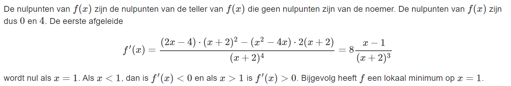

# Vraag 1

Bereken de afgeleide van volgende functie:

## Antwoord 1

### Hint 1

Werk eerst het product uit en probeer er vervolgens een som van te maken.

# Vraag 2

## Antwoord 2

### Hint 2

# Vraag 3

Vind de tweede afgeleide van volgende functie:

## Antwoord 3

### Hint 3

De tweede afgeleide van een functie is de afgeleide van de afgeleide functie. Denk aan de rekenregels van afgeleiden.

# Vraag 4

Vind de afgeleide van volgende functie:

## Antwoord 4

### Hint 4

# Vraag 5

Vind de afgeleide van volgende functie:

## Antwoord 5

### Hint 5

# Vraag 6

Bereken de afgeleide van volgende functie:

## Antwoord 6

### Hint 6

# Vraag 7

Bereken de afgeleide van volgende functie:

## Antwoord 7

### Hint 7

# Vraag 8

De grafiek van de functie:

## Antwoord 8

### Hint 8

Bepaal voor welke x uit het domein van f geldt dat f(x)=0.
