# Vraag 1

Voor welke waarde van k is de rechte x+y=k een raaklijn aan de kromme y=x^2?

## Antwoord 1

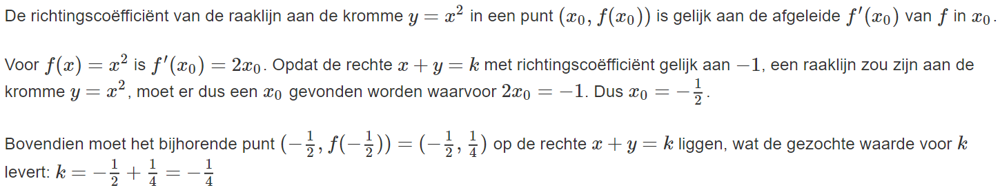

### Hint 1

Gebruik de meetkundige betekenis van de afgeleide als richtingscoëfficiënt van de raaklijn aan de gegeven functie.

# Vraag 2

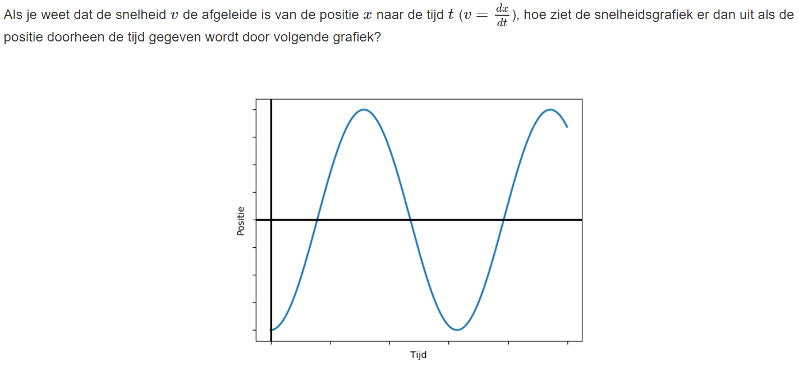

## Antwoord 2

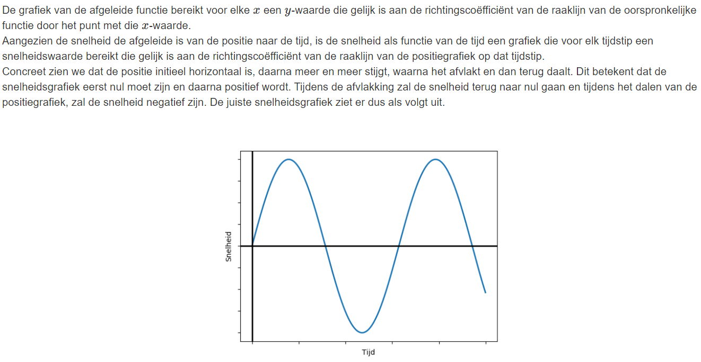

### Hint 2

De grafiek van de afgeleide functie bereikt voor elke x een y -waarde die gelijk is aan de richtingscoëfficiënt van de raaklijn van de oorspronkelijke functie door het punt met die x-waarde.

# Vraag 3

Bereken de afgeleide van volgende functie:

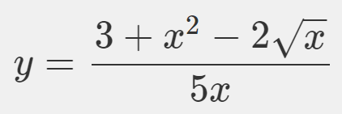

## Antwoord 3

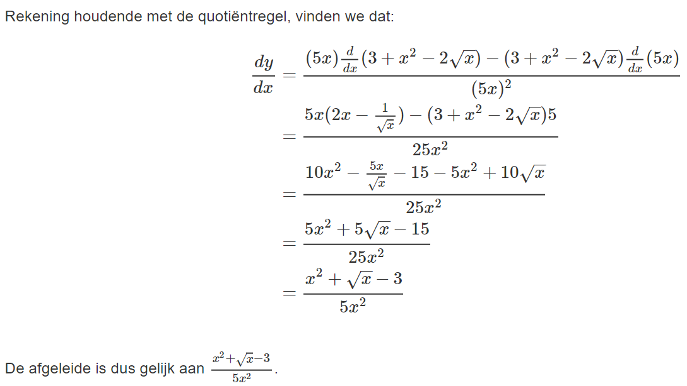

### Hint 3

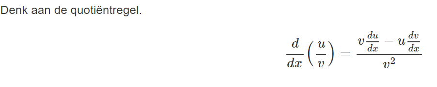

# Vraag 4

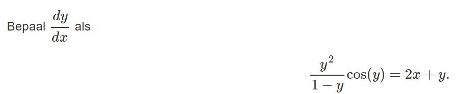

## Antwoord 4

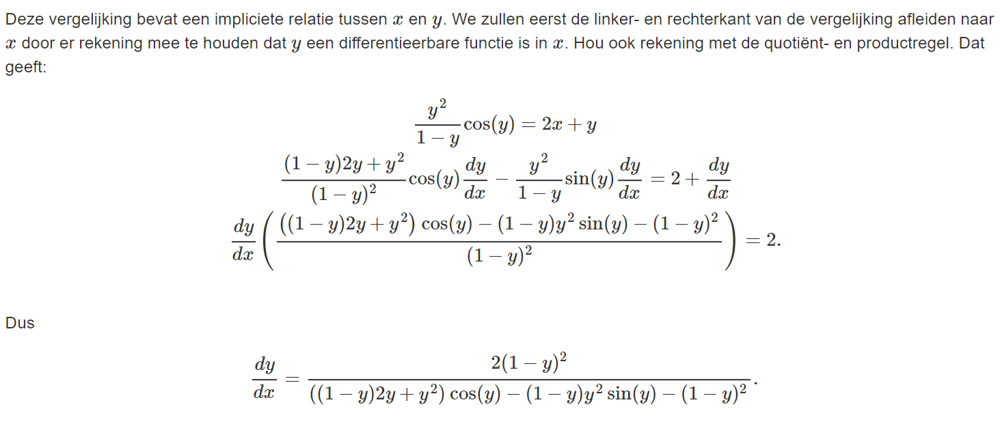

### Hint 4

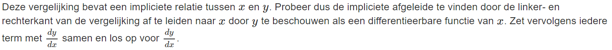

# Vraag 5

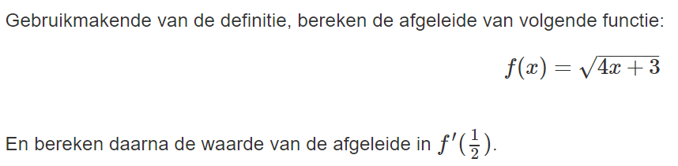

## Antwoord 5

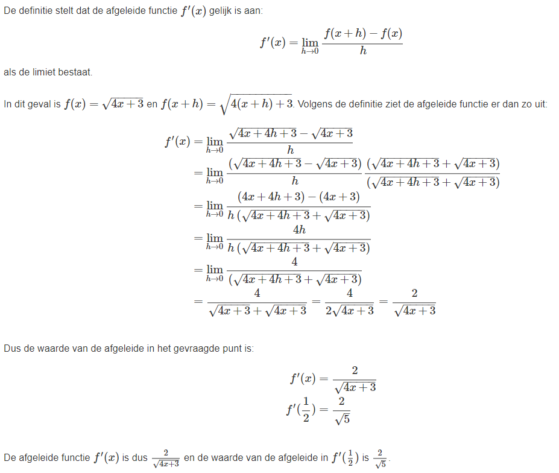

### Hint 5

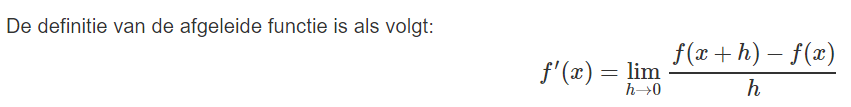

# Vraag 6

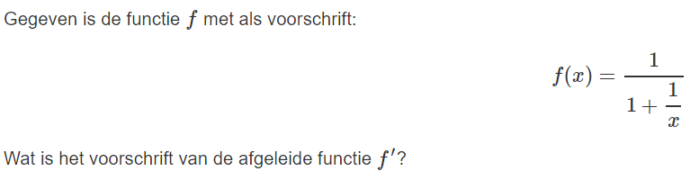

## Antwoord 6

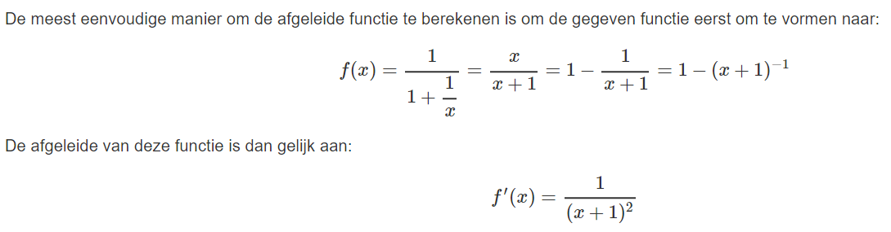

### Hint 6

Gebruik de kettingregel om de afgeleide functie te bekomen.

# Vraag 7

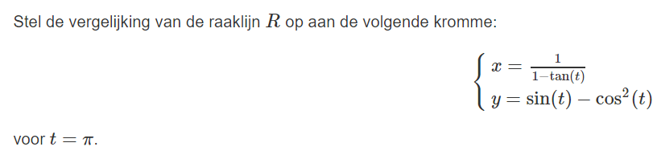

## Antwoord 7

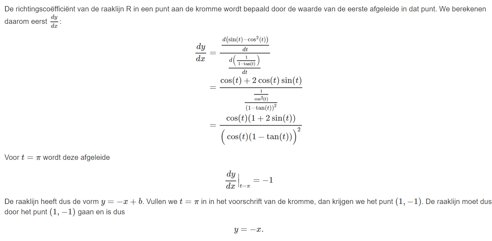

### Hint 7

De richtingscoëfficiënt van de raaklijn R in een punt aan een kromme wordt bepaald door de waarde van de eerste afgeleide in dat punt.
