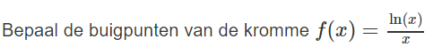
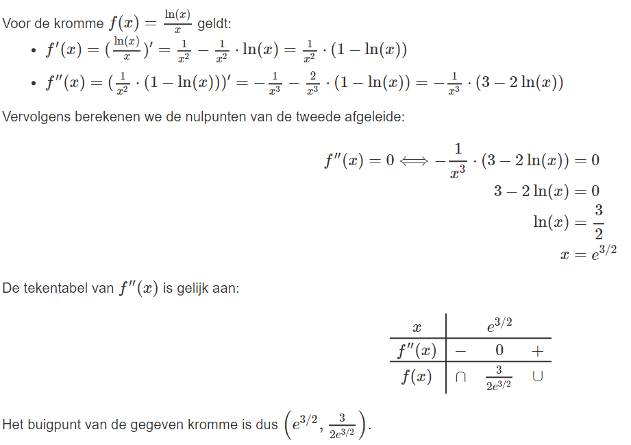
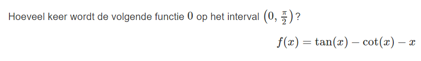
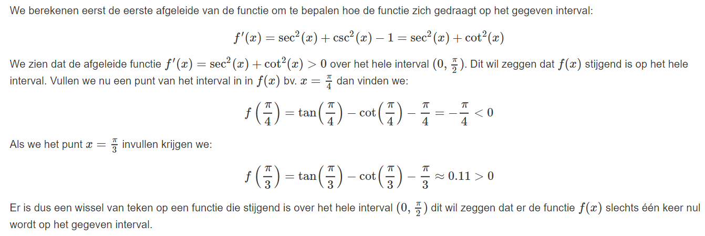
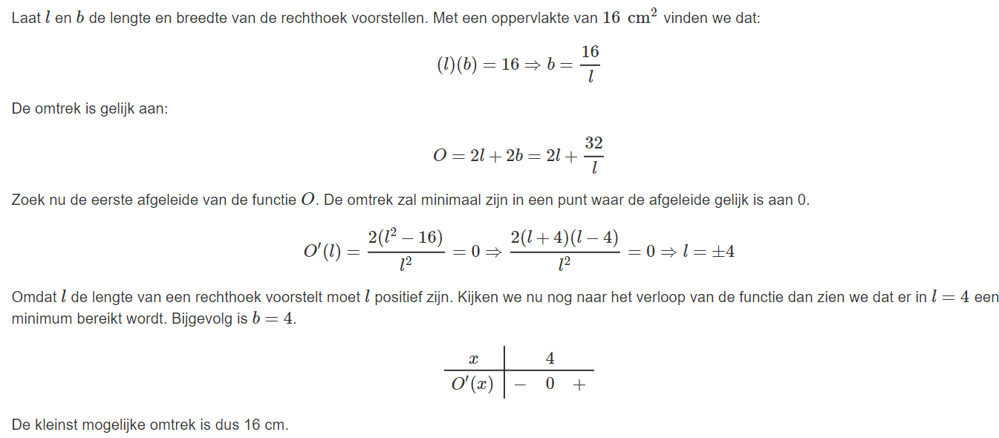
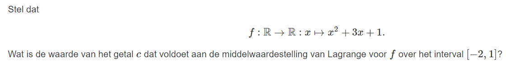
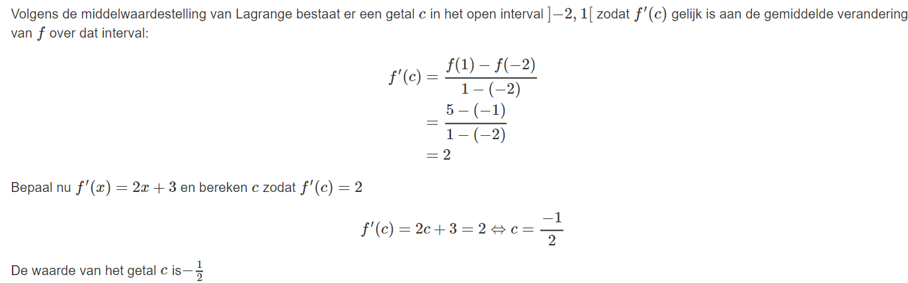
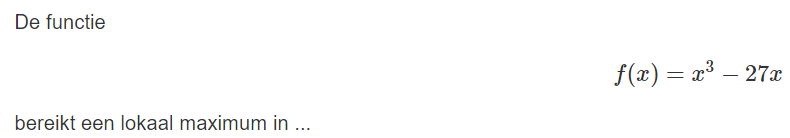
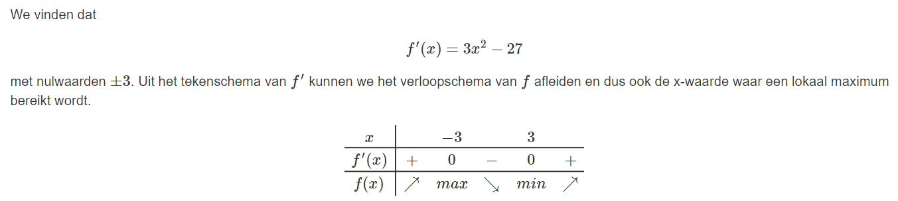

# Vraag 1

# Antwoord 1

# Hint 1

Als f continu is in a en f′′ verandert van teken in a en er bestaat een raaklijn aan de grafiek in (a,f(a)), dan heeft de grafiek van f een buigpunt in a

# Vraag 2

# Antwoord 2

# Hint 2

Bereken de eerste afgeleide van de functie en bekijk hoe de functie zich zal gedragen op het gegeven interval. Wat kan je nu besluiten over het aantal nulwaarden?

# Vraag 3

Wat is de kleinste omtrek mogelijk voor een rechthoek met een oppervlakte van 16cm^2?

# Antwoord 3

# Hint 3

Bepaal de functie die de omtrek van de rechthoek beschrijft in functie van 1 variabele.

# Vraag 4

# Antwoord 4

# Hint 4

Volgens de middelwaardestelling van Lagrange bestaat er een getal c in het open interval ]−2,1[ zodat f′(c) gelijk is aan de gemiddelde verandering van f over dat interval.

# Vraag 5

# Antwoord 5

# Hint 5

Bepaal voor welke x uit het domein van f geldt dat f'(x)=0
