# Vraag 1

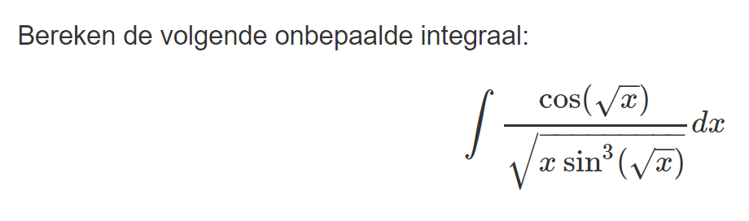

# Antwoord 1

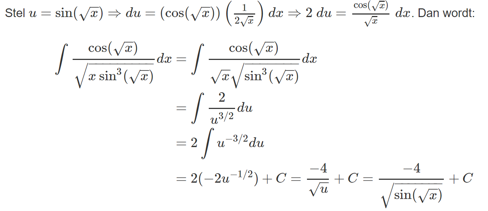

# Hint 1

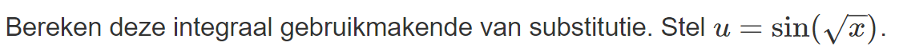

# Vraag 2

# Antwoord 2

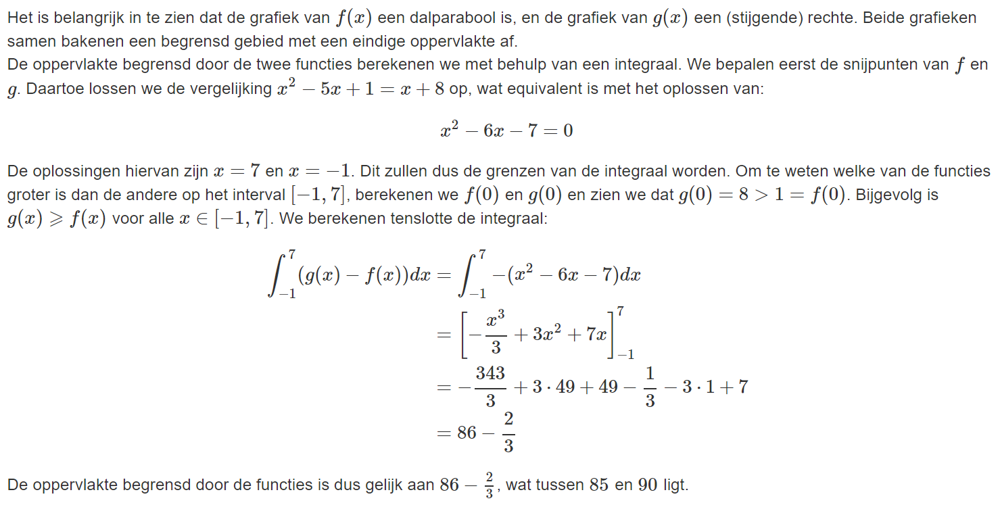

# Hint 2

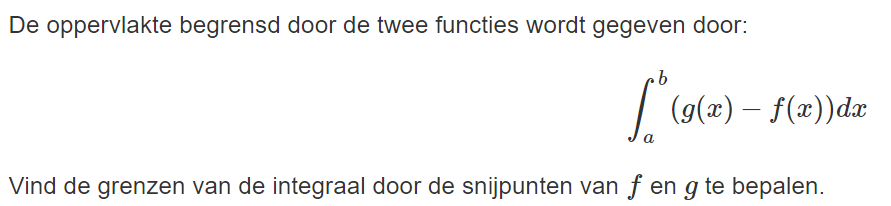

# Vraag 3

# Antwoord 3

# Hint 3

Gebruik substitutie om deze bepaalde integraal op te lossen. Vergeet niet de grenzen ook aan te passen!

# Vraag 4

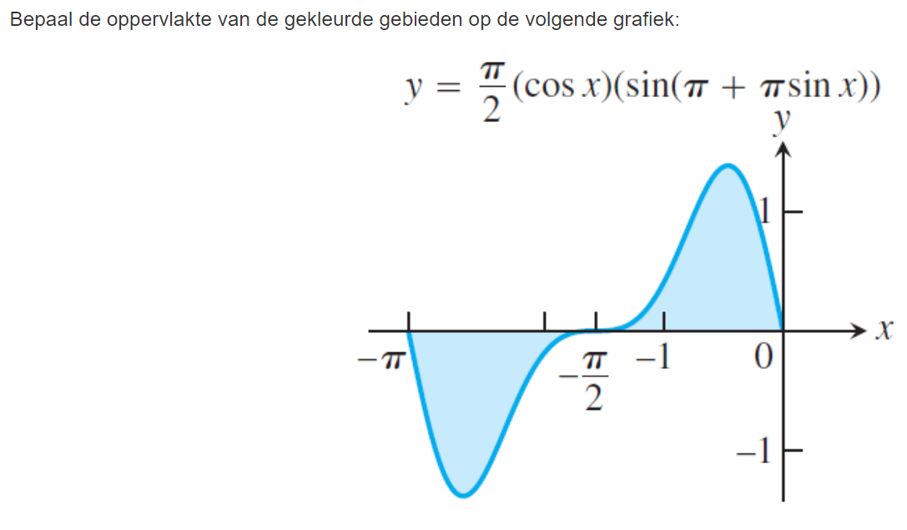

# Antwoord 4

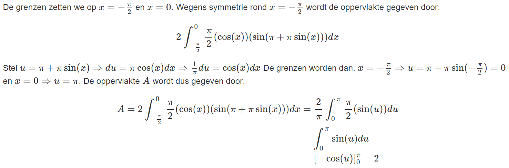

# Hint 4

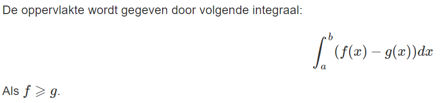

# Vraag 5

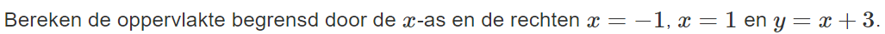

# Antwoord 5

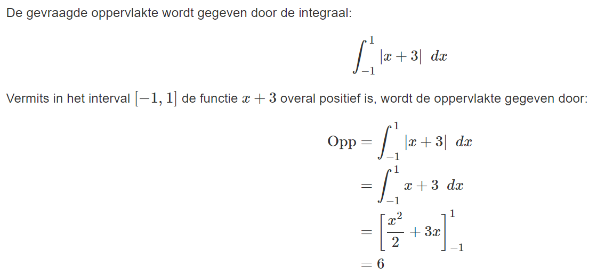

# Hint 5

Schets het opgegeven gebied.

# Vraag 6

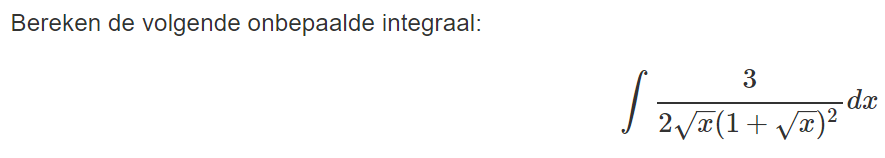

# Antwoord 6

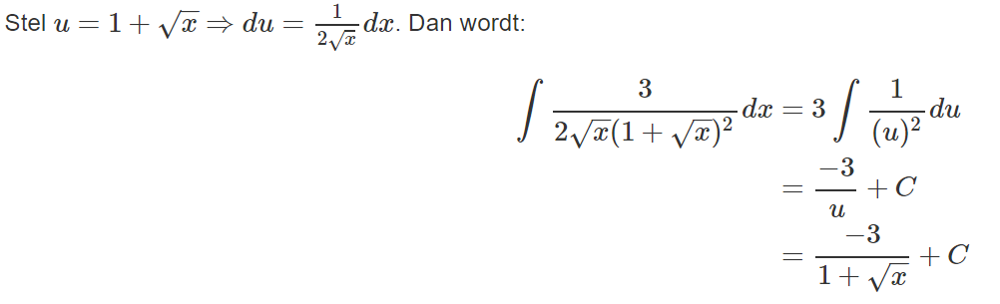

# Hint 6

Bereken deze integraal gebruikmakende van substitutie.

# Vraag 7

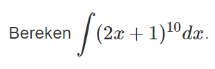

# Antwoord 7

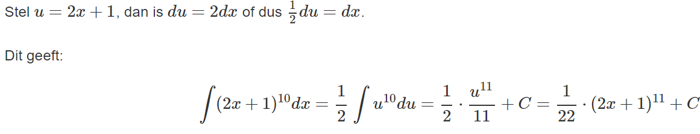

# Hint 7

Gebruik de substitutieregel.

# Vraag 8

# Antwoord 8

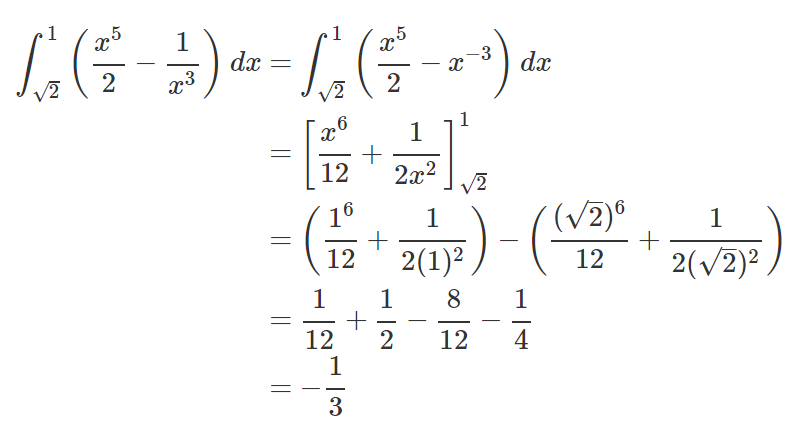

# Hint 8

Pas de rekenregels voor het integreren van veeltermen toe.
