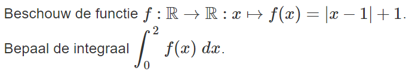
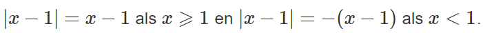
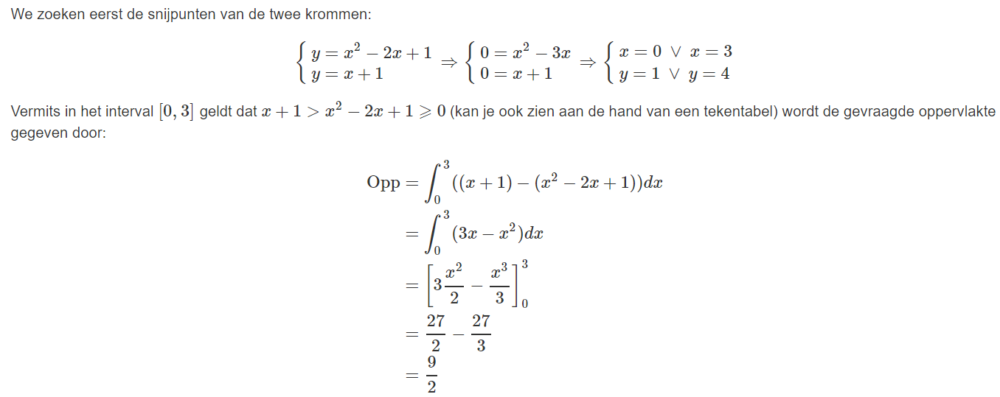

# Vraag 1

# Antwoord 1

# Hint 1

# Vraag 2

# Antwoord 2

# Hint 2

# Vraag 3

# Antwoord 3

# Hint 3

Pas de rekenregels voor het integreren van veeltermen toe.

# Vraag 4

# Antwoord 4

# Hint 4

Maak een schets.

# Vraag 5

# Antwoord 5

# Hint 5

# Vraag 6

# Antwoord 6

# Hint 6

Werk het kwadraat uit en schrijf als een som van integralen van machten van x

# Vraag 7

# Antwoord 7

# Hint 7

Schets het opgegeven gebied.

# Vraag 8

# Antwoord 8

# Hint 8

Schets het gevraagde gebied.
