# Vraag 1

# Antwoord 1

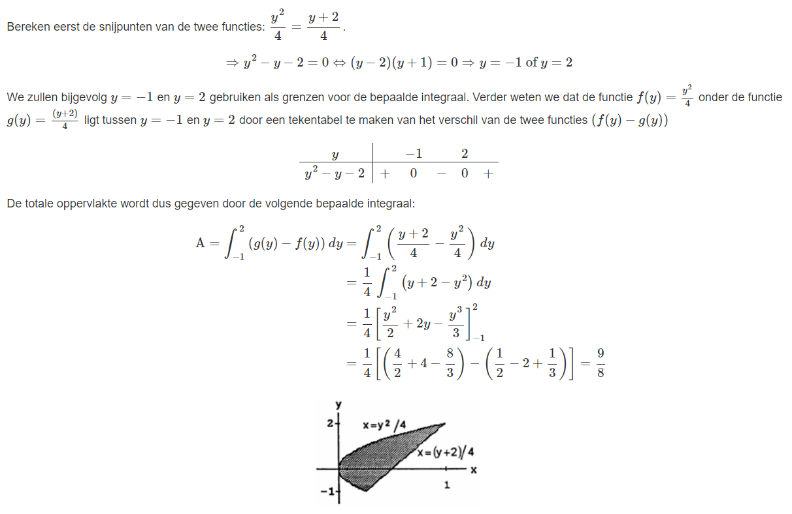

# Hint 1

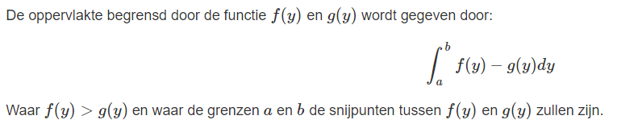

# Vraag 2

# Antwoord 2

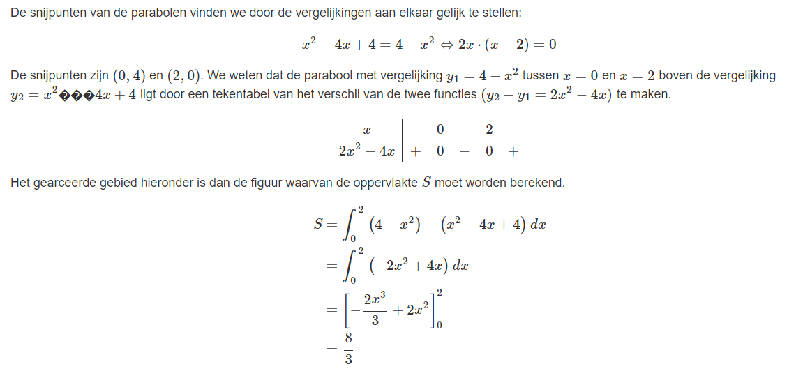
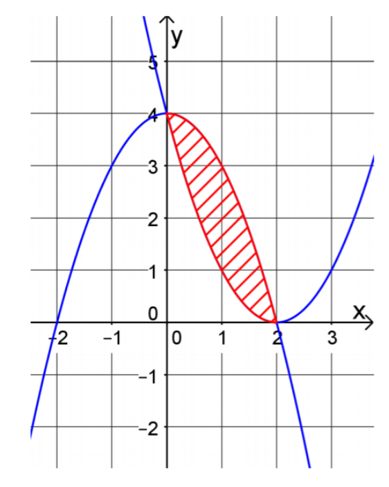

# Hint 2

Maak een schets.

# Vraag 3

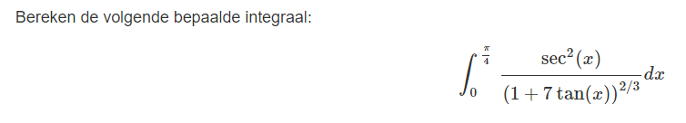

# Antwoord 3

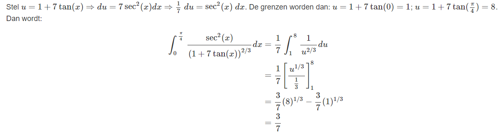

# Hint 3

Bereken deze integraal gebruikmakende van substitutie. Stel u=1+7tan(x). Vergeet niet om de grenzen ook aan te passen!

# Vraag 4

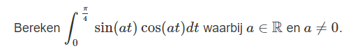

# Antwoord 4

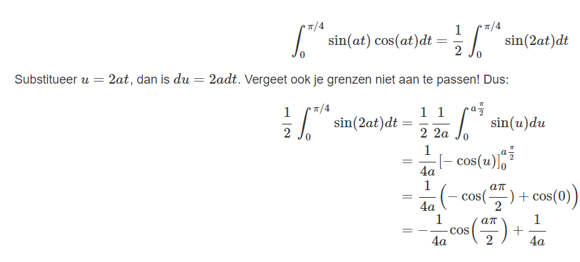

# Hint 4

Vereenvoudig de functie die je wil integreren door de verdubbelingsfromule te gebruiken: sin(2x)=2sin(x)cos(x)

# Vraag 5

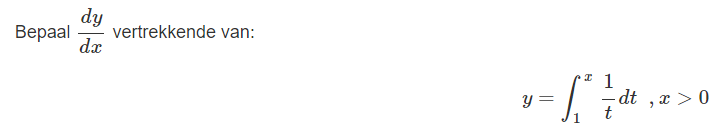

# Antwoord 5

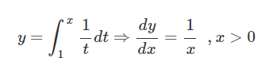

# Hint 5

Denk aan het fundamentele theorema van calculus.

# Vraag 6

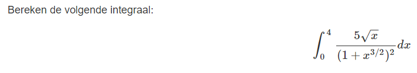

# Antwoord 6

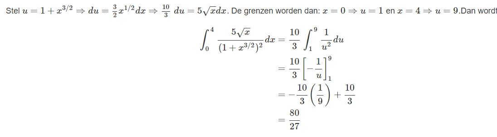

# Hint 6

# Vraag 7

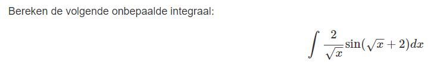

# Antwoord 7

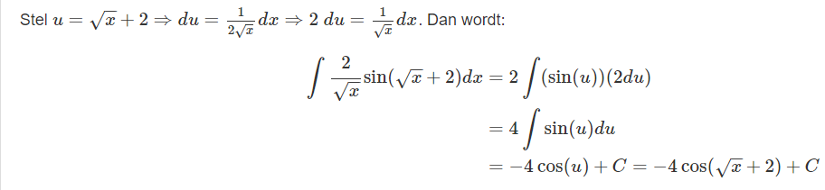

# Hint 7

Bereken deze integraal gebruikmakende van substitutie.

# Vraag 8

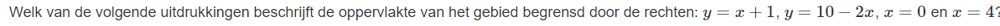

# Antwoord 8

# Hint 8

Schets het gegeven gebied.
