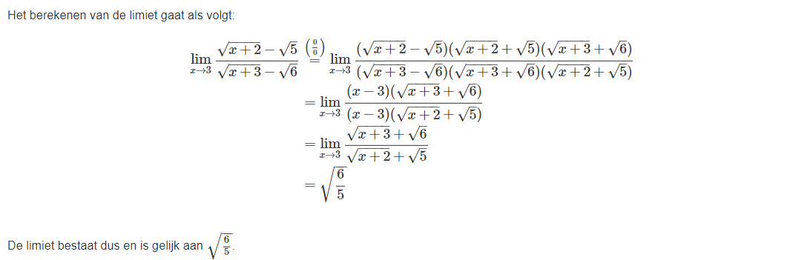
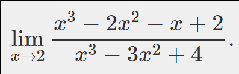
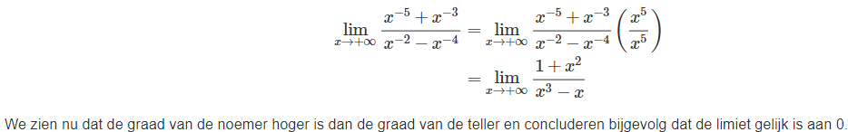
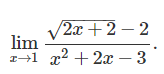
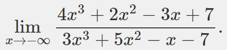
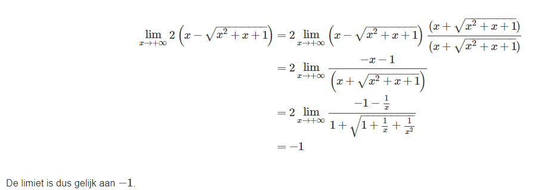
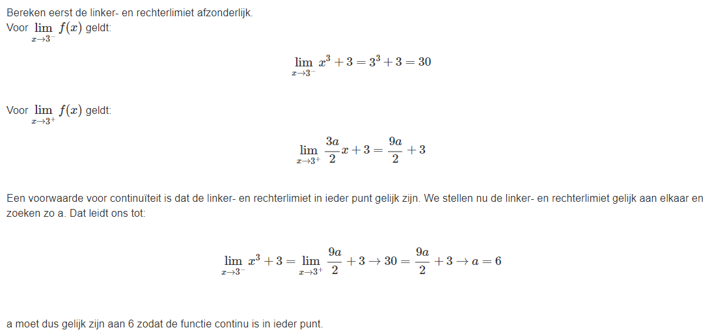

# Vraag 1

Bereken, indien mogelijk, volgende limiet:

## Oplossing 1

### Hint

We hebben een rationale functie met een wortel in de teller en in de noemer. We kunnen deze functie vereenvoudigen door de teller en noemer te vermenigvuldigen met de toegevoegde wortel van de noemer en met de toegevoegde wortel van de teller.

# Vraag 2

Welke stelling over onderstaande limiet is correct?

## Oplossing 2

### Hint

Ontbind teller en noemer in factoren zodat je gemeenschappelijke factoren kan schrappen. Let daarna op de nulpunten van de noemer en vertrek daaruit om de limiet, indien mogelijk, te bepalen.

# Vraag 3

Vind volgende limiet

## Oplossing 3

### Hint

Denk eraan dat de limiet lim_x→0(sin(x)/x) gekend is.

# Vraag 4

Vind volgende limiet:

## Oplossing 4

### Hint

Herwerk naar een vorm waar je enkel nog machten in teller en noemer ziet staan met positieve exponenten.

# Vraag 5

Welke stelling over onderstaande limiet is correct?

## Oplossing 5

### Hint

Dit is een irrationale functie, waarbij x=1 zowel een nulpunt is van de teller als van de noemer. We kunnen dit voorschrift dus vereenvoudigen door te vermenigvuldigen en te delen door de toegevoegde uitdrukkingen van zowel de teller als de noemer.

# Vraag 6

Welke stelling over onderstaande limiet is correct?

## Oplossing 6

### Hint

Deel teller en noemer door x^3.

# Vraag 7

Bereken de limiet van volgende functie:

## Oplossing 7

### Hint

vermenigvuldig teller en noemer met de toegevoegde term van (x-sqrt(x^2+x+1)) zodat de wortel in de teller verdwijnt.

# Vraag 8

Beschouw de volgende functie:

Voor welke waarde van a is de functie continu in ieder punt?

## Oplossing 8

### Hint

Wat is de voorwaarde voor een functie opdat ze continu is voor elke waarde van x? Denk aan de linker- en rechterlimiet.
