# Vraag 1

Vind de volgende limiet

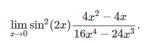

## Oplossing 1

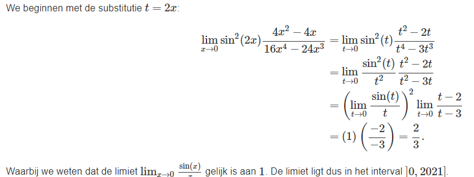

### Hint

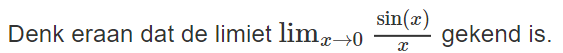

# Vraag 2

Welke stelling over onderstaande limiet is correct?

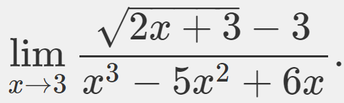

## Oplossing 2

### Hint

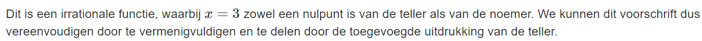

# Vraag 3

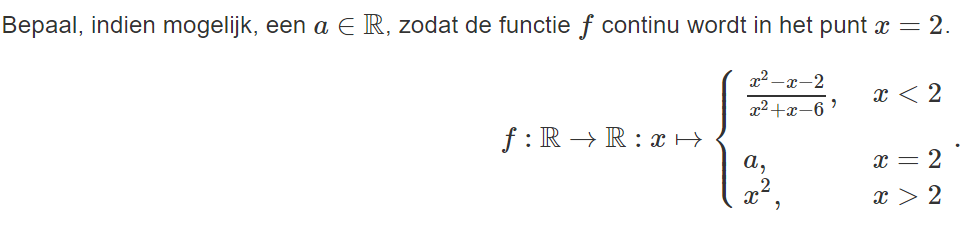

## Oplossing 3

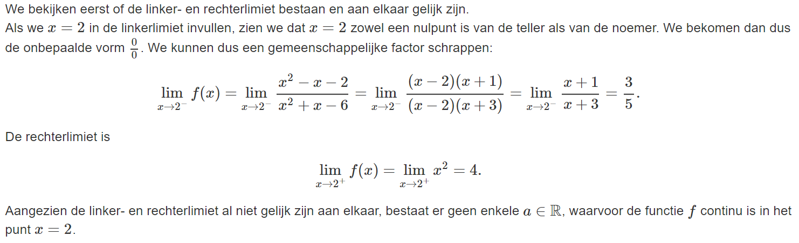

### Hint

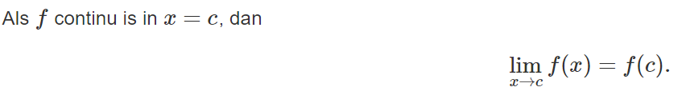

# Vraag 4

Bereken, indien mogelijk, volgende limiet:

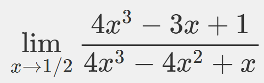

## Oplossing 4

### Hint

Ontbind de teller en de noemer in factoren.

# Vraag 5

## Oplossing 5

### Hint

Ontbind teller en noemer in factoren zodat je een gemeenschappelijke term kan schrappen. Let daarna op de nulpunten van de noemer en vertrek daaruit om de limiet, indien mogelijk, te bepalen.

# Vraag 6

Welke stelling over onderstaande limiet is correct?

## Oplossing 6

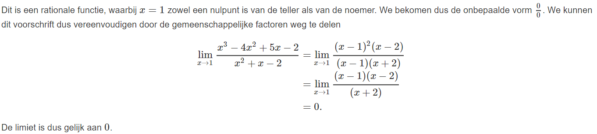

### Hint

Ontbind teller en noemer in factoren.

# Vraag 7

Welke stelling over onderstaande limiet is correct?

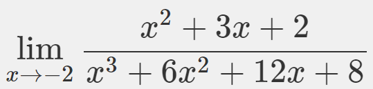

## Oplossing 7

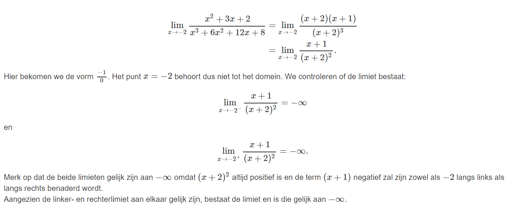

### Hint

Ontbind teller en noemer in factoren zodat je gemeenschappelijke factoren kan schrappen. Let daarna op de nulpunten van de noemer en vertrek daaruit om de limiet, indien mogelijk, te bepalen.

# Vraag 8

Vind volgende limiet:

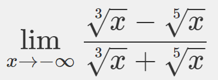

## Oplossing 8

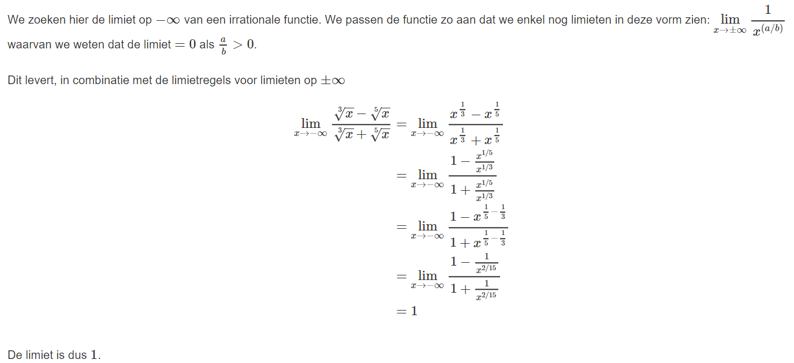

### Hint

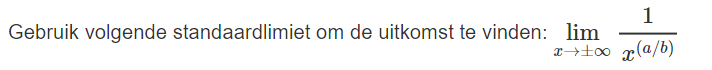
